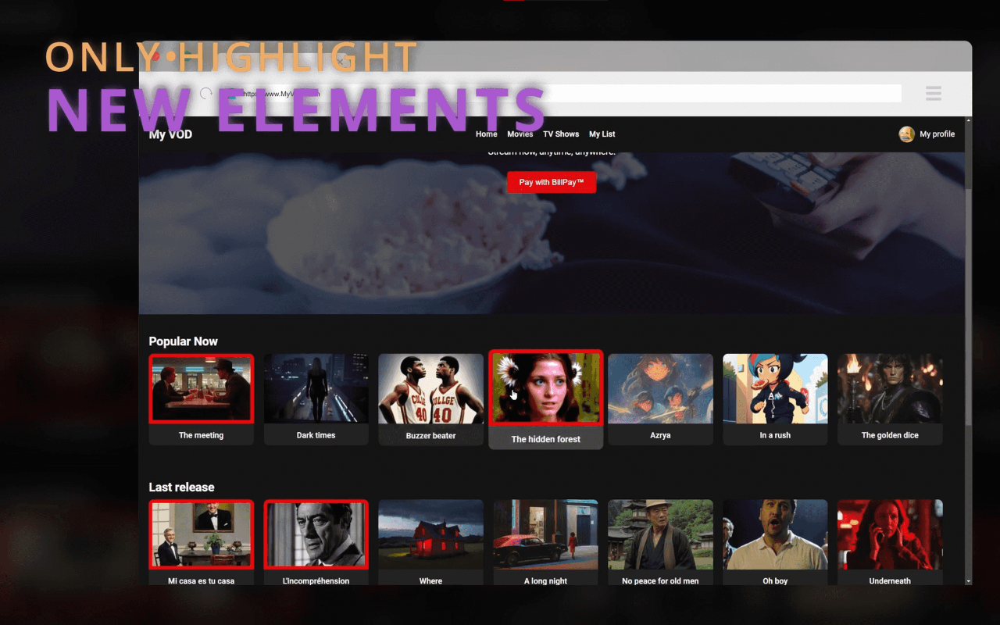

 

Highlight new links and/or images on your favorite web pages!\
Full support for multiple pages and infinite scrolling with Regex!

 

> [!TIP]
> Are you looking for the [Regex tester](https://philjbt.github.io/AlreadySeen/manual_regex/regex_tester.html) or the [Regex manual](https://github.com/PhilJbt/AlreadySeen/tree/main/docs/manual_regex)?

 

 

 

> Third-party credits: 
> Domain Check Library: https://github.com/lupomontero/psl 
> Logo: https://www.flaticon.com/authors/andinur
> Trash icon: https://www.flaticon.com/authors/kumakamu
> Info icon: https://www.flaticon.com/authors/anggara