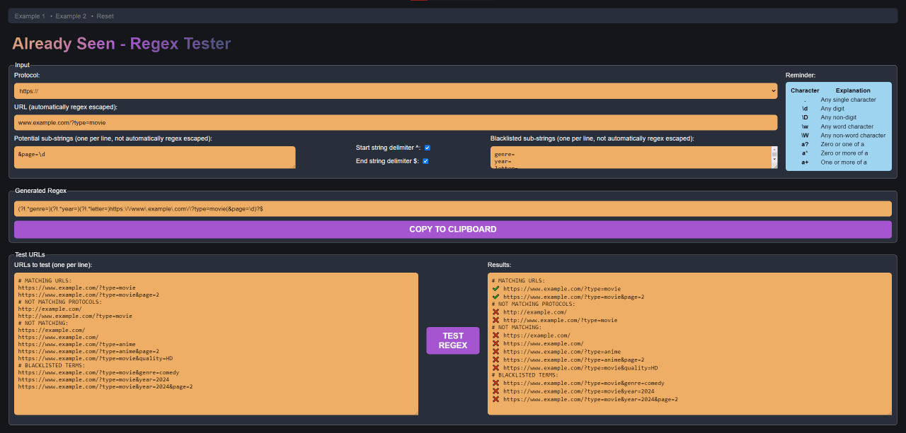

|  |  |
| -- | --- |

# 1. Qu'est-ce qu'un Regex ?

Regex (expression régulière) est une séquence de caractères qui définit un modèle de recherche, généralement utilisé pour la correspondance de modèles, la recherche et le remplacement de texte dans des chaînes.\
Dans le cas d'_Already Seen_, cela permet à l'utilisateur de surveiller plusieurs pages avec une seule ligne (et donc une seule base de données, de sorte que les images et/ou les liens de n'importe quelle page ne seront pas traités comme nouveaux pour chaque page différente).\
Vous pouvez également mettre certains mots sur liste noire, afin que l'URL ne soit pas surveillée s'ils apparaissent.

# 2. Exemple pratique

Si vous souhaitez surveiller l'URL **`exemple.com/?type=film`** ainsi que les variations dues à la pagination telles que **`exemple.com/?type=film&page=2`**, mais pas lorsque vous recherchez un type de film spécifique comme **`exemple.com/?type=film&genre=action`**, voici l'expression régulière que vous devez écrire :

> <!---->(?!.*genre=)https:\/\/exemple\.com\/\?type=film

De cette façon, de nombreuses variantes comme **`exemple.com/?type=film&quality=HD`** seront prises en compte, à moins que le mot *`genre`* n'apparaisse.
  
Au contraire, si vous préférez exclure quelque chose d'inattendu, voici ce que vous devez écrire :

> <!---->^https:\/\/exemple\.com\/\?type=film(&page=\d)?$

# 3. Caractères échappés

Pourquoi écrire `https:\/\/exemple\.com` au lieu de `https://exemple.com` ? Parce que certains caractères sont littéralement utilisés par la Regex.\
Par exemple, l'expression régulière **`page=[0-9]+`** détecte :

> La chaîne de caractères **`page=`**,\
> puis **`n'importe quel chiffre de 0 à 9`**,\
> avec **`au moins une répétition`**.

De cette façon, il est possible de détecter **`page=1`**, tout comme **`page=96`**.

 

> [!TIP]
> J'ai réalisé un testeur Regex, qui est disponible à cette adresse :\
> https://philjbt.github.io/AlreadySeen/manual_regex/regex_tester.html?action=example1

